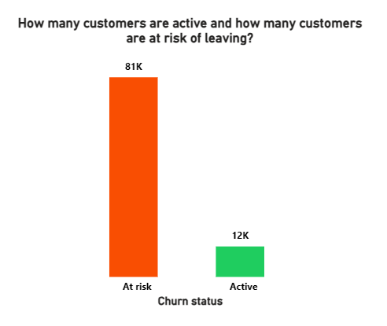
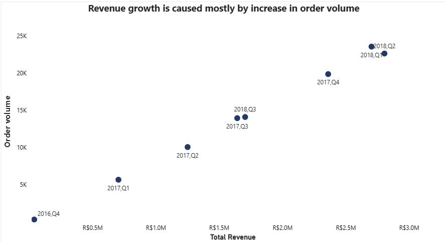
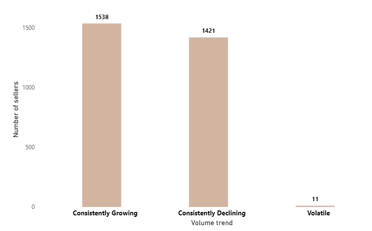
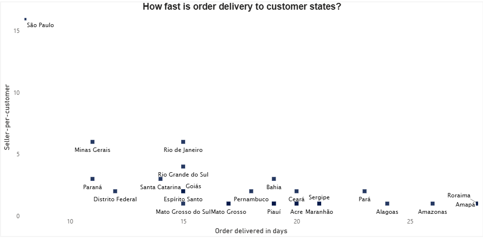

# **Customer Intelligence & Commercial Performance Review: Understanding who buys, what sells, and how fast it arrives on Brazil's largest e-Commerce marketplace**

### **Tools used: MS SQL, Power BI**

## **Business problem:**
Olist is a Brazilian e-commerce marketplace connecting thousands of sellers to millions of customers has accumulated three years of transactional data across its platform. 

Despite strong order volume growth and an increasing revenue year by year, the commercial and operations leadership team lacks a consolidated view of the behaviours driving growth and the inefficiencies threatening to slow it.
The business does not know which customers are genuinely loyal versus one-time buyers unlikely to return. 
It cannot identify which product categories are losing market relevance before the decline becomes a revenue problem. 
It has no clear picture of whether rising revenue reflects real demand growth or simply price inflation masking volume stagnation  while seller performance is tracked individually but never benchmarked for growth trajectory at scale and delivery performance has never been mapped systematically across 27 states in Brazil. 

In this project, I will act as the operations analyst responsible for 
* Segmenting customers by purchase breadth and frequency.
* Detecting early churn risk across the active customer base and
identifying product categories in consistent volume decline.
* Determining whether revenue growth is price-driven or demand-driven, 
rank sellers by account base trajectory.
* Benchmark delivery performance by state.

The goal is to deliver an executive summary that enables the Commercial Director and Head of Operations to make three specific decisions: 
where to focus retention investment, which product categories require strategic review, 
and which delivery regions require logistics intervention.

### **Link to the dataset:** [Olist dataset on kaggle.com](https://www.kaggle.com/datasets/olistbr/brazilian-ecommerce)

## **Business questions to be answered**
- Which customers consistently buy a broad product mix vs single-category buyers?
- Which customers have not placed an order in the last 60/90 days?
- What does the purchase frequency distribution look like across the customer base?
- Which products have shown consistent volume decline over the last 3–4 periods?
- How has volume changed following each price adjustment period?
- Does revenue growth come from price increases or volume growth?
- What is the average order-to-delivery time by region, and how has it trended?
- Which sales reps are growing their account base? Which are declining?

##

| Metrics and KPI | Value |
|-----------------|-------|
| Average revenue per customer | R$141.62 |
| Total customers | 96,096 |
| Total sellers | 3095 |
| Total product categories | 73 |
| Customer retention rate | 33.3%|
| Prompt delivery rate | 91.9% |
| Seller growth rate | 33.3% |

##

## **Key findings** 

- **Buyer's segment:** The total customers were grouped into 3 different categories namely ***Single_category_buyers(buyers who bought from only one product category)***,***Narrow_buyers(buyers who bought from 3 categories or less than that)***, **Moderate_buyers(buyers who bought from 5 categories or less than)** and ***Broad_buyers(customers who bought from 6 categories and more)*** to understand the purchase pattern of each customer group. This classification has shown that 97% of the customer base belongs in the single category buyers who have generated ***R$12,671,584.4 (95.8%)*** of the total revenue for the business during the period.

- **Purchase frequency:** Following the same pattern as the customer segment, the amount of orders made by customers was used to group them in ranges from ***1-2, 3-5, 6-9, 10-12, 13-14 and 15+.*** Results show that a total of ***93,306 customers***(***96%***) of the customer base belong in the lower purchase frequency who made purchases between ***1 to 9 times*** while less than ***5%*** of the customer base patronised the business at least ***10 times*** and more. 
However, the customers with a higher purchase frequency had a higher average amount spent per order (***R$880*** is the average amount spent by customers who made purchases between ***10 and 12 times***, ***R$702*** was the average amount spent by customers who patronised the business between ***13 and 14 times***) while a lower average amount spent per order is highly prevalant in the lower purchase frequency (***R$136*** is the average amount spent by customers who bought from the business ***1 to 2 times***, ***R$283*** is the average amount spent by customers who purchased from the business ***3-5 times*** and ***R$511*** amongst customers who purchased from the business ***6 -9 times***).

- **Churn detection:** The dataset ranged from ***2016 to 2018*** ;the latest purchase date was used to determine the last time a customer has patronised the business.The following rules were adopted: customers whose number of days since last purchase is 60 days and above are tagged ***At risk***, customers whose number of days since last purchase is 90 days and above are tagged ***Churned*** while customers whose last purchase are below that are tagged ***Active***. In a similar fashion with buyers segment and purchase frequency, ***80,980(86.7%)*** customers were discovered to be at risk of not purchasing from the business while ***12,370(13%)*** of the customers are active on the site. It is also important to note that 2,746 customer records existed in the dataset with no associated order items likely representing registered accounts that never completed a purchase. 
These were excluded from segmentation analysis. All segment metrics reflect customers with at least one confirmed purchase

***VERDICT:*** *Majority of the customers make little purchases from the site with a large time gap in betweeen their purchases.*

- **Revenue growth source:** The data shows business operations for 9 consecutive quarters where only the first period ***(2016, q3)*** had the least revenue recorded ***(R$40,336)*** and it was subsequently followed by revenue growth as a result of both price and volume increase. ***2017's*** revenue growth in its first 3 quarters came from volume increase only followed by revenue growth from both price increase and volume increase in its last quarter. ***2018*** was the most volatile year where revenue growth ***(R$2,704,438.38)*** in its 1st quarter came from volume increase only, revenue growth ***(R$2,806,670.75)*** in its 2nd quarter came from price increase only and a decline in revenue( ***R$1,706,063.11)*** was experienced in its 3rd quarter.

- **Order volume growth:** The economic rule of recession where recession is declared after 2 consecutive quarters of economic decline was borrowed here however, in this case, 3 quarters of consecutive growth or decline is determined per seller. 1538(51.8%) of the sellers experienced consistent growing order volume, 1421(47.8%) of them experienced declining order volume and 11(0.33%) experienced a volatile order volume during the period

- **Average order to delivery time in days:** ***Sao Paulo*** has the fastest order to delivery time ***(8 days)*** which can be attributed to its being the capital city and also having the highest amount of ***sellers-per-customer ratio(16:1)***. States like ***Minas Gerais*** and ***Parana*** are the second closest to the capital city with their delivery coming in **11 days*** after making order;customers in ***Distrito Federal*** and ***Santa Catarina*** also have experienced a similar treatment with orders coming in at ***12 and 14 days*** on average respectively while states like ***Goias Espirito Santos, Mato Grosso do Sul, Rio de Janeiro and Rio Grande do Sul*** have their deliveries coming in at an average of ***15 days***. In a reverse fashion, states with slow delivery like **Mato Grosso Tocantin Pernambuco, Bahia** etc have deliveries coming in as late as 20 days due to low order rate from those states and a low seller-to-buyer ratio in those states. Delivery also went up as high as 24 to 28 days in other states

***VERDICT:*** *Revenue is increasing every year, sellers on the platform are also increasing their sales volume but a slow order to delivery time is peculiar most states.*

## **Recommendations**
- Single category buyers and Narrow buyers represent 97% of buyers of the customer base. However it has been proven that customers who buy from 3-5 or more categories spend at least 3-4x on average per visit than those single category buyers. It is advisable for the business to launch a targeted post-purchase recommendation engine surfacing adjacent categories to single-category buyers particularly those still active within the last 60 days who represents the highest return on investment available to the business.

- Discount vouchers, free shipping or category-specific promotion(e.g buy 5 packs and get 1 free) should be deployed to customers whose last purchase date is above 60 days and less than 90 days as this can improve the recovery probability of customers within this section. Higher priority should also be given to customers within this category who are also narrow and moderate buyers as they have demonstrated their higher spending capacity

- Olist is a marketplace with nearly half of its sellers losing their customers. This can be addressed with targeted seller support, reduced commission for all sellers at risk and a favourable onboarding programme for replacement sellers. This can be solved by actively onboarding more sellers into states with slow delivery times and also partnering with a logistics company to further reduce the time between order made and order delivery.

